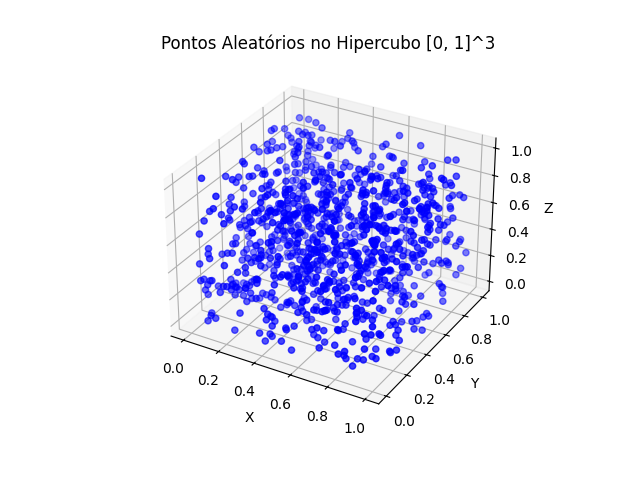

## Integração Numérica com Monte Carlo utilizando Threads

### Introdução

O cálculo de integrais, especialmente em dimensões altas, pode ser extremamente difícil e demorado usando métodos tradicionais. O **Método de Monte Carlo** é uma abordagem poderosa que usa **amostragem aleatória** para estimar integrais de funções complexas. Este método pode ser ainda mais eficiente quando combinado com **execução paralela** utilizando **threads** para acelerar o processo de cálculo.

### O Problema

Desejamos calcular a seguinte integral definida:

$$
I = \int_{0}^{1} \int_{0}^{1} \dots \int_{0}^{1} e^{-\sum_{i=1}^n x_i^2} \,dx_1 dx_2 \dots dx_n
$$

A função a ser integrada é:

$$
f(x) = e^{-\sum_{i=1}^n x_i^2}
$$

E estamos integrando no domínio $[0,1]^n$, que é um **hipercubo** $n$-dimensional com lados de comprimento 1.




### Método de Monte Carlo

O método de Monte Carlo para calcular integrais segue os seguintes passos básicos:

1. **Gerar pontos aleatórios** dentro do domínio de integração. No nosso caso, isso significa gerar valores aleatórios para $x_1, x_2, ..., x_n$ no intervalo $[0, 1]$.
2. **Avaliar a função** nesses pontos aleatórios.
3. **Calcular a média** dos valores da função nos pontos gerados.
4. Multiplicar essa média pelo **volume do domínio**. No caso do hipercubo  $[0,1]^n$, o volume é 1, pois é um quadrado (ou hipercubo) com comprimento de lado 1 em cada dimensão.

Assim, a integral é aproximada pela média dos valores da função nas amostras multiplicada pelo volume do domínio.

### A Fórmula para a Integral de Monte Carlo

Se $f(x)$ for a função a ser integrada em um domínio $D$ (no nosso caso, o hipercubo $[0]^n$), a fórmula do Método de Monte Carlo é:

$$
I \approx \frac{1}{N} \sum_{i=1}^{N} f(x_i)
$$

onde $N$ é o número de pontos amostrados, e $x_i$ são pontos aleatórios dentro do domínio $D$.

### Função a Ser Integrada

No código original, a função $f(x)$ a ser integrada foi definida da seguinte forma:

```python
def f(x):
    """Função que queremos integrar."""
    return sum(-xi**2 for xi in x)
```

Aqui, a função $f(x)$ recebe um vetor de variáveis $x = [x_1, x_2, ..., x_n]$ e retorna $-\sum_{i=1}^n x_i^2$. Essa é a forma negativa da função gaussiana que estamos integrando. O sinal negativo é utilizado porque a função foi escrita dessa forma no código original para aproximar a integral de uma função exponencial.

### Exemplos de Outras Funções

Aqui estão alguns exemplos de outras funções que poderiam ser usadas no lugar da função $f(x)$ para calcular a integral:

#### Exemplo 1: Função $f(x) = x_1 + x_2 + \dots + x_n$

Este é um exemplo simples de uma função linear, onde estamos somando as variáveis $x_i$:

```python
def f(x):
    """Função linear simples."""
    return sum(x)  # Soma dos componentes x_i
```

#### Exemplo 2: Função $f(x) = x_1^2 + x_2^2 + \dots + x_n^2$

Neste caso, estamos somando os quadrados das variáveis $x_i$:

```python
def f(x):
    """Função quadrática simples."""
    return sum(xi**2 for xi in x)  # Soma dos quadrados dos componentes
```

#### Exemplo 3: Função $f(x) = \sin(x_1 + x_2 + \dots + x_n)$

Este exemplo considera uma função trigonométrica que depende da soma das variáveis:

```python
import math

def f(x):
    """Função que soma as coordenadas e aplica o seno."""
    return math.sin(sum(x))  # Seno da soma das coordenadas
```

#### Exemplo 4: Função $f(x) = \cos(x_1 + x_2 + \dots + x_n)$

Neste caso, estamos trabalhando com a função cosseno:

```python
import math

def f(x):
    """Função que soma as coordenadas e aplica o cosseno."""
    return math.cos(sum(x))  # Cosseno da soma das coordenadas
```

#### Exemplo 5: Função $f(x) = \tan(x_1 + x_2 + \dots + x_n)$

Aqui, estamos considerando a função tangente:

```python
import math

def f(x):
    """Função que soma as coordenadas e aplica a tangente."""
    return math.tan(sum(x))  # Tangente da soma das coordenadas
```

#### Exemplo 6: Função $f(x) = e^{-(x_1 + x_2 + \dots + x_n)}$

Agora, estamos trabalhando com uma função exponencial, que pode ser útil em diversos problemas de modelagem e física.

```python
import math

def f(x):
    """Função exponencial decaindo com a soma das coordenadas."""
    return math.exp(-sum(x))  # Exponencial decaindo com a soma das coordenadas
```

#### Exemplo 7: Função $f(x) = \prod_{i=1}^{n} x_i$

Aqui, estamos considerando o produto das variáveis $x_1, x_2, ..., x_n$.

```python
def f(x):
    """Função produto das coordenadas."""
    result = 1
    for xi in x:
        result *= xi
    return result
```

#### Exemplo 8: Função $f(x) = 1$ (Função Constante)

Se a função $f(x)$ for uma constante, digamos 1, temos:

```python
def f(x):
    """Função constante 1."""
    return 1  # A função é constante, sempre 1
```

### Explicação do Código

Agora, vamos analisar o código passo a passo.

#### Importação das Bibliotecas

```python
import threading
import random
import time
import queue
```

- **`threading`**: A biblioteca `threading` é utilizada para criar e gerenciar múltiplas threads. No código, usamos threads para realizar o cálculo da integral em paralelo, dividindo o trabalho entre várias threads e, assim, acelerando a execução do código.
  
- **`random`**: A biblioteca `random` é responsável por gerar números aleatórios. Em nosso caso, ela é usada para gerar as coordenadas $x_i$ aleatórias para os pontos de amostragem dentro do intervalo $[0, 1]$.
  
- **`time`**: A biblioteca `time` é utilizada para medir o tempo de execução do código. No exemplo, utilizamos o `time.time()` para registrar o tempo antes e depois da execução, permitindo calcular o tempo total de execução da integral.
  
- **`queue`**: A biblioteca `queue` é utilizada para gerenciar o armazenamento dos resultados de cada thread. A `queue.Queue()` permite que as threads armazenem seus resultados de forma segura e eficiente, para que possamos agregá-los no final da execução.

#### Função Principal

```python
def main():
    DIMENSIONS = 5   # Número de dimensões
    TOTAL_POINTS = 10_000_000  # Total de pontos
    NUM_THREADS = 10
    points_per_thread = TOTAL_POINTS // NUM_THREADS
    result_queue = queue.Queue()
    threads = []
    
    start_time = time.time()
```

A função `main` é onde a execução do código começa. Os parâmetros principais são definidos:

- **`DIMENSIONS`**: Representa o número de dimensões da integral. No exemplo, estamos trabalhando com 5 dimensões, mas este número pode ser alterado conforme necessário.
  
- **`TOTAL_POINTS`**: O número total de pontos a serem amostrados. Quanto maior o número de pontos, mais precisa será a estimativa da integral.
  
- **`NUM_THREADS`**: O número de threads a ser utilizado. O código cria esse número de threads para realizar a amostragem de pontos em paralelo.

- **`points_per_thread`**: O número de pontos que cada thread deve calcular. Ele é calculado dividindo o total de pontos pelo número de threads.

- **`result_queue`**: A fila onde os resultados das threads serão armazenados.

- **`threads`**: A lista onde todas as threads criadas serão armazenadas.

#### Criação e Execução das Threads

```python
    for i in range(NUM_THREADS):
        thread = threading.Thread(target=monte_carlo_integral, args=(points_per_thread, DIMENSIONS, result_queue, i+1))
        threads.append(thread)
        thread.start()
```

Aqui, o código cria as threads. Para cada thread, a função `monte_carlo_integral` é chamada com os parâmetros necessários. Cada thread calcula a integral para uma quantidade de pontos determinada e armazena os resultados na fila.

#### Sincronização das Threads

```python
    for thread in threads:
        thread.join()
```

Após iniciar todas as threads, o código espera até que todas elas finalizem usando o método `join()`. Esse comando garante que a execução do código principal (a função `main`) só continue após todas as threads terminarem.

#### Cálculo da Integral Final

```python
    integral_estimate = sum(result_queue.get() for _ in range(NUM_THREADS)) / NUM_THREADS
```

Aqui, a média dos resultados obtidos por todas as threads é calculada. A função `get()` é utilizada para recuperar os resultados armazenados na fila `result_queue`.

#### Exibição dos Resultados

```python
    end_time = time.time()
    print(f"Estimativa da Integral: {integral_estimate:.6f}")
    print(f"Tempo de execução: {end_time - start_time:.4f} segundos")
```

Finalmente, o código exibe a estimativa da integral, bem como o tempo total de execução, calculado pela diferença entre os tempos de início e término.

### Conclusão

O **Método de Monte Carlo** paralelizado com threads permite estimar integrais de alta dimensão de forma eficiente. O código pode ser facilmente adaptado para diferentes funções e domínios, basta alterar a função $f(x)$ e ajustar os parâmetros conforme necessário. Quanto maior o número de pontos gerados e o número de threads, mais precisa será a estimativa da integral.

```
